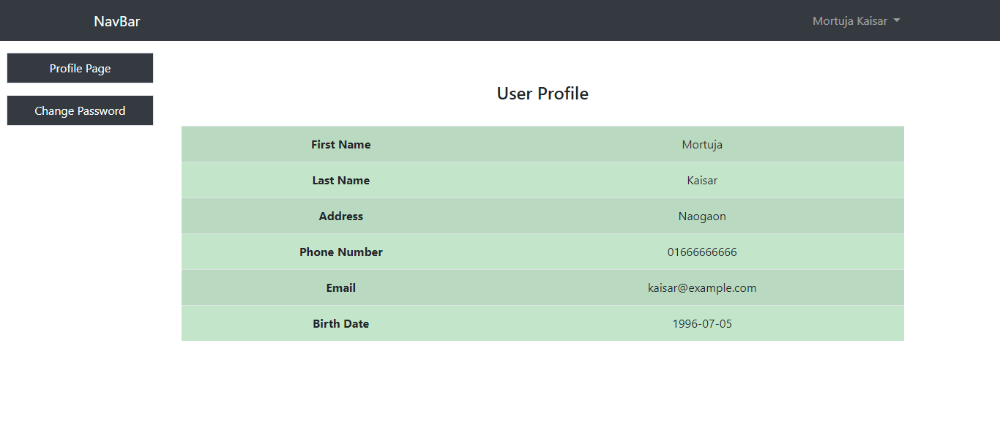

# Documentation
# Registration-System-App-Using-Grails

 This Project are simply login-registration system.User who are registered they can show their profile.
    and perform some other operation. Admin are able to show all registered users. 

<h1> Technology </h1>

<table>
  <tr>
    <td> Grails </td>
    <td> Version - 3.2.1 </td>
  </tr>
  <tr>
    <td> Groovy </td>
    <td> Version - 2.4.7 </td>
  </tr>
  <tr>
    <td> JVM </td>
    <td> Version - 1.8.0_202 </td>
  </tr>
  <tr>
    <td> MySQL </td>
    <td>  </td>
  </tr>
  <tr>
    <td> XAMPP </td>
    <td>  </td>
  </tr>
</table>

<h2> Here you need to run this application are changed the Database username and password and set database name from application.yml 
     file </h2>

# Application Demo

# Login Page

<h5> url: http://localhost:8080/ </h5>
<h4> Admin Credential</h4>
<h5> Email: admin@localhost.local </h5>
<h5> Password: admin </h5>

# Registration Page

# Profile Page

# Change Password Page

# Admin Panel

# Search Panel

